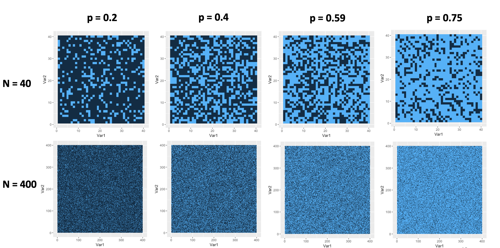
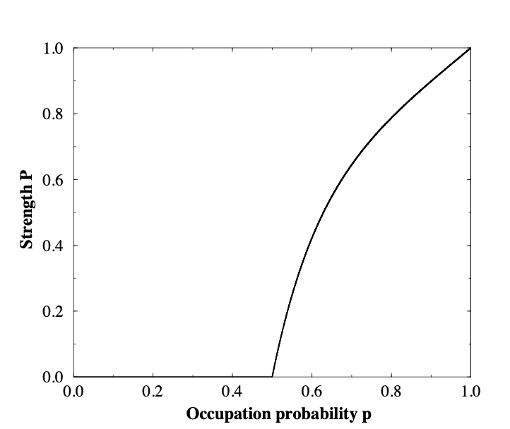
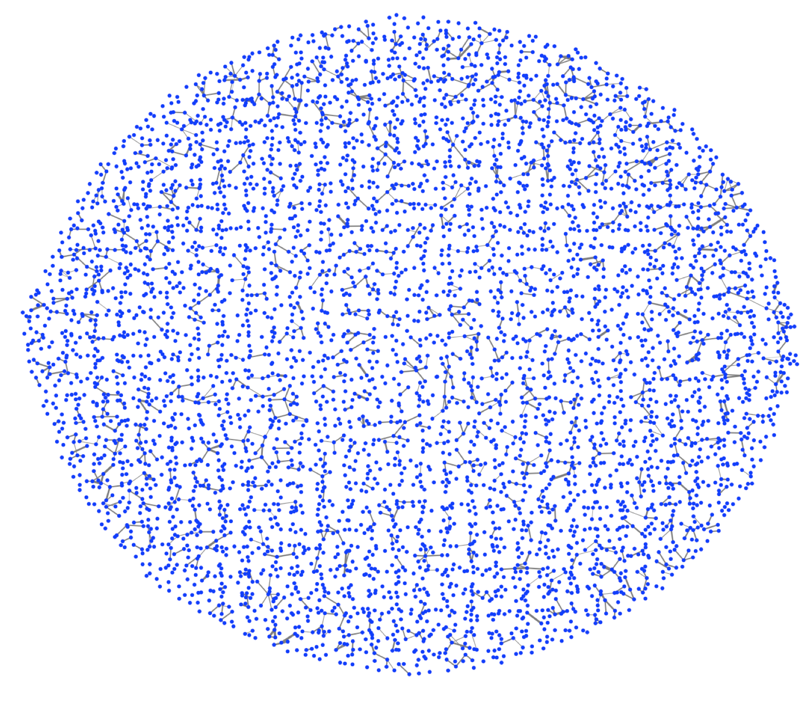
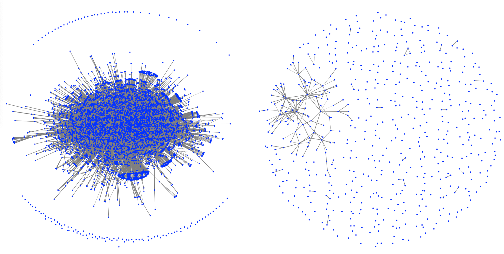
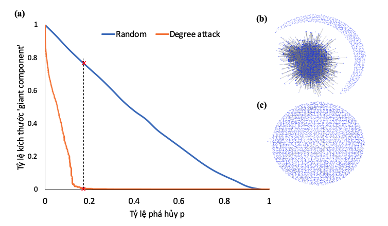
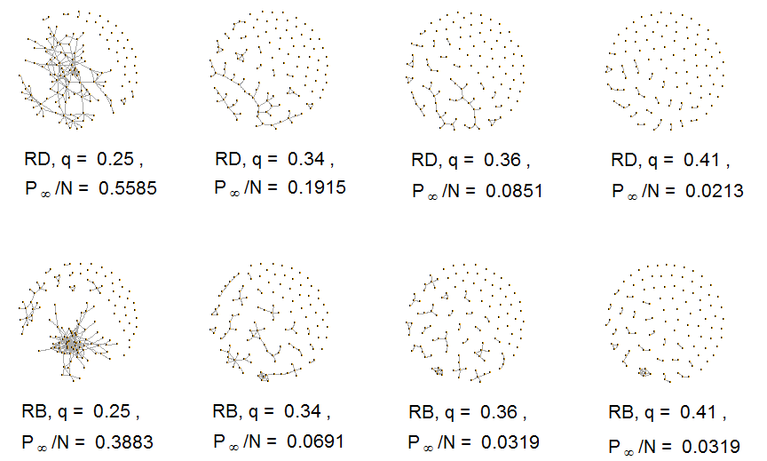
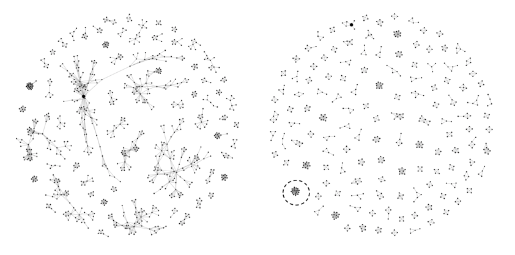

# Tính bền vững của mạng lưới

Tính bền vững ("Robustness/Resilience")  của mạng lưới là tính chất được nghiên cứu đầu tiên nằm trong các chủ đề về các quá trình động lực. Do các Hệ phức hợp rất phổ biến trong thực tế, nghiên cứu về sự bền vững của chúng có ý nghĩa ứng dụng thực tế cao. Một số câu hỏi có thể giải đáp là:

- Mạng Internet có bền vững trước những sự cố hỏng hóc hay không? Nếu bị mất đi một số đỉnh (router) thì có thể hoạt động bình thường được không?
- Một số sân bay bị đóng/tấn công thì ảnh hưởng đến bao nhiêu lưu lượng hành khác, có dẫn đến ngưng trệ dây chuyền hay không?
- Các sự cố mất điện hàng loạt trên lưới điện diễn ra vì sao, như thế nào? làm sao ngăn chặn được sự cố này? (thiết kế lưới như thế nào)
- Cần tiêm ngừa bao nhiêu phần trăm dân số để ngăn ngừa lây nhiễm cộng đồng?
- Trong y khoa, vì sao một số đột biến gien có thể gây bệnh còn số khác thì không (bản đồ gen)

Chúng ta tạm thời dùng khái niệm phổ biến nhất đề định nghĩa **tính bền vững** như sau: một mạng lưới được gọi là bền vững nếu thành phần có kích thước lớn nhất của nó (LCC - "Largest connected components") có kích thước (số lượng đỉnh) cùng bậc độ lớn với kích thước ban đầu của mạng.

Trong hướng nghiên cứu này, lý thuyết Thẩm thấu ("Percolation") từ Vật lý đã được sử dụng và có nhiều kết quả quan trọng. Chúng ta sẽ giới thiệu ngắn gọn lý thuyết này trước khi ứng dụng nó vào Khoa học mạng lưới.

## Lý thuyết thẩm thấu (Percolation)
Đây là một lý thuyết đã được phát triển trong Toán học và Vật lý nhằm trả lời một câu hỏi điển hình như sau: 

Cho một mạng lưới hai chiều hình vuông với N điểm giao mỗi chiều (tổng cộng N$\times$N điểm). Đặt vào mỗi điểm giao một viên đá với xác suất $p$. Câu hỏi đặt ra là:

1. Thành phần lớn nhất trong bàn cờ có kích thước bao nhiêu?

2. Các thành phần có kích thước tuân theo phân bố nào?

Hình vẽ sau thể hiện các điểm giao là các ô vuông:

```{r percolation2D, fig.align = 'center', out.width = "100%", fig.cap = "Biểu diễn ví dụ thẩm thấu 2 chiều với các xác suất khác nhau và kích thước khác nhau", echo = FALSE}

```

Có thể thấy ngay là với $p$ càng lớn thì kích thước của LCC càng lớn. Nhưng khác với trực giác chúng ta hình dung, kích thước của LCC sẽ không tăng một cách tuyến tính theo $p$. Nếu mô phỏng với N rất lớn (tiến tới vô cùng), kích thước LCC $L_{\infty}$ sẽ gần bằng 0 với $p$ nhỏ, sau đó đột ngột tăng lên tại một điểm tới hạn gọi là $p_c$

```{r pc2D, fig.align = 'center', out.width = "50%", fig.cap = "Thay đổi kích thước của LCC theo xác suất lấp đầy p, với N lớn. Nguồn: Kim Christensen - “Percolation Theory”", echo = FALSE}

```

Sự thay đổi đột ngột ở điểm tới hạn là một sự *chuyển pha*. Ở đó, kích thước của LCC tăng đột ngột từ 0 lên giá trị tỷ lệ với kích thước của mạng. Một cách nhìn khác là: nếu mặt hồ có tỷ lệ đóng băng trên $p_c$ thì chúng ta có thể đi từ bờ này sang bờ kia.

Sử dụng lý thuyết xác suất các bài toán thẩm thấu cho các chiều, cho đỉnh và cạnh đã được giải tường minh cho mọi chiều. Với bài toán 2 chiều, xác suất lấp đầy tới hạn cho đỉnh là $p_c = 0.593$. [1]

Với số chiều là vô cùng tương ứng bài toán lưới Bethe trong vật lý. 

Ngoài ra, chúng ta còn quan tâm đến một số đại lượng khác như (trong giới hạn N lớn):

- Kích thước trung bình các thành phần

\begin{equation} 
  \langle s\rangle \sim |p-p_c|^{-\gamma_p}
  (\#eq:AvgCluster)
\end{equation}

Nói cách khác, gần tới điểm tới hạn $p_c$ thì kích thước trung bình các thành phần phân kỳ (tăng lên vô cùng) do các thành phần bắt đầu nhập lại.

- Tham số bậc: $P_{\infty}$

Xác suất $P_{\infty}$ của một viên sỏi bất kỳ nằm trong thành phần kích thước lớn nhất cũng theo hàm mũ:

\begin{equation} 
  P_{\infty} \sim |p-p_c|^{\beta_p}
  (\#eq:probInf)
\end{equation}

Khi $p$ giảm dần về điểm tới hạn $p_c$ thì xác suất một viên sỏi bất kỳ nằm trong thành phần kích thước lớn nhất giảm về không do thành phần kích thước lớn nhất bị chia nhỏ ra và tồn tại rất nhiều thành phần nhỏ rời rạc.

- Độ dài tương tác $\xi$

Khoảng cách trung bình giữa hai viên sỏi trong cùng một thành phần tuân theo hàm mũ khi gần điểm tới hạn:

\begin{equation} 
  \xi \sim |p-p_c|^{-\nu}
  (\#eq:CorrLength)
\end{equation}

Nói cách khác, khi $p < p_c$ thì khoảng cách trung bình trong cùng thành phần là nhỏ, khoảng cách này tăng lên vô cùng khi tới điểm tới hạn do các thành phần nhập lại (tạo thành thành phần rất lớn)


Các hệ số mũ $\gamma_p, \beta_p và \nu$ được gọi là các hệ số mũ tới hạn. Lý thuyết thẩm thấu dự đoán là các hệ số này là thống nhất, có nghĩa là độc lập với tính kết nối của mạng lưới cũng như giá trị của $p_c$ (dù là kết nối hình vuông hay tam giác, bát giác, .. cũng đều có cùng các hệ số tới hạn).

Các bài toán thẩm thấu có nhiều ứng dụng trong vật liệu và sinh học. 
Với khoa học mạng lưới chúng ta quan tâm đến bài toán ngược của bài toán thẩm thấu: Khi phá hủy một tỷ lệ $q$ đỉnh khỏi mạng lưới, mạng lưới có hoạt động bình thường được không? Bày toán này tương ứng bài toán thẩm thấu theo chiều ngược lại với $p = 1 - q$ giảm dần.

## Áp dụng Lý thuyết thẩm thấu trong Khoa học mạng lưới 
Vào năm 2000, Babarasi và cộng sự đã có một bài báo quan trọng trên Nature cho thấy rằng: mạng Internet rất bền vững trước những hỏng hóc ngẫu nhiên của các đỉnh (router) - mạng chỉ bị sập hoàn toàn nếu 92% số đỉnh bị hỏng một cách ngẫu nhiên. Ngược lại, mạng Internet cũng rất dễ bị phá vỡ nếu chỉ cần 16% số đỉnh có số kết nối cao nhất bị hỏng. Đây là hai tính chất quan trọng của các mạng phức hợp thực tế có phân bố là hàm mũ. 

Ngay sau đó, các nhà khoa học khác đã xây dựng các mô hình để chứng minh các con số trên. Nếu mạng lưới là một mạng cố định không gian trong 2 chiều (với mỗi đỉnh có 4 liên kết) thì chúng ta có thể sử dụng ngay kết quả của bài toán thẩm thấu ở trên. Tuy nhiên, mạng lưới thực tế lại thường có liên kết bất kỳ và có phân phối bậc theo dạng hàm mũ. GS. Shmolov Havlin, M. N. Newman cùng cộng sự là những tác giả chính đã áp dụng rất tài tình lý thuyết thẩm thấu cho các mạng phân phối mũ, còn gọi là "scaled-free" như sau.

### Tiêu chuẩn Molloy and Reed
Molloy and Reed chứng minh một tiêu chuẩn để tồn tại một LCC có kích thước cùng bậc với kích thước mạng lưới (gọi là "giant component") cho một mạng có phân phối bậc $P(k)$ như sau: $\kappa \equiv \frac{\langle k^2 \rangle}{\langle k\rangle} = 2$
cho một mạng lưới ngẫu nhiên (các liên kết không có tương quan).

Tiêu chuẩn này được Havlin và cộng sự lập luận lại như sau:

Một mạng lưới có phân bố bậc $P(k)$ có "giant component" nếu, đi từ một cạnh của thành phần này, đỉnh tới được phải có **trung bình ít nhất thêm một cạnh khác nữa**. Như vậy giả sử đỉnh $i$ được nối với $j$ (thuộc "giant component") thì số bậc trung bình của $i$ ít nhất bằng 2:

\begin{align} \label{GiantCond}
\langle k_i | i\leftrightarrow j\rangle = \sum_{k_i} k_i P(k_i | i \leftrightarrow j )=2
\end{align}

Sử dụng công thức Bayes's ta có
\begin{align} \label{Bayes}
P(k_i | i \leftrightarrow j ) = P(k_i , i \leftrightarrow j )/P(i \leftrightarrow j )\\
=P(i \leftrightarrow j | k_i )P(k_i)/P(i \leftrightarrow j )
\end{align}

Với một mạng ngẫu nhiên không có vòng lặp:
$P(i \leftrightarrow j ) = \langle k\rangle/(N-1) $ và $P(i \leftrightarrow j | k_i )= k_i/(N-1)$ (coi như xác suất tìm thấy mỗi cạnh là giống nhau)

khi đó (\ref{GiantCond}) trở thành:
\begin{align} \label{GiantCond2}
\sum_{k_i} k_i P(k_i | i \leftrightarrow j )=\sum_{k_i}k_i P(i \leftrightarrow j | k_i )P(k_i)/P(i \leftrightarrow j )\\
=\sum_{k_i}k_i \frac{\frac{k_i}{(N-1)} P(k_i)}{\frac{\langle k\rangle}{(N-1)}}\\
=\sum_{k_i}k_i^2P(k_i)/\langle k\rangle
\end{align}

Cuối cùng điều kiện để tồn tại "giant component" là:
\begin{align} \label{MR_criteria}
\kappa \equiv \frac{\langle k^2 \rangle}{\langle k\rangle} = 2
\end{align}

Một "giant component" tồn tại khi $\kappa > 2$. Với $\kappa < 2$ mạng chỉ chứa những thành phần rất nhỏ không cùng bậc với kích thước mạng lưới. Trước đó, tiêu chuẩn này đã được Molloy and Reed tìm ra bằng phương pháp giải tích.

```{r bitcoinCondWBet720, fig.align = 'center', out.width = "70%", fig.cap = "Một mạng lưới không tồn tại 'giant component' với kappa < 2", echo = FALSE}

```

### Tính thẩm thấu ngẫu nhiên
Để áp dụng lý thuyết thẩm thấu chúng ta cho phá hủy một mạng lưới bằng cách lấy ra ngẫu nhiên $q = 1-p$ số đỉnh của mạng. Khi đó, xác suất của một đỉnh có $k$ bậc nếu bạn đầu nó có $k_0$ bậc là:

\begin{align} \label{binomial}
\left( \substack{k_0 \\ k} \right) p^k (1-p)^{k_0-k}
\end{align}

Và phân bố bậc mới trở thành:
\begin{align} \label{new_degree}
P(k) = \sum_{k_0 = k}^{\infty} P(k_0) \left( \substack{k_0 \\ k} \right) p^k (1-p)^{k_0-k}
\end{align}

Như vậy chúng ta có thể tính lại các moment bậc 1 và 2 như sau:
\begin{align} \label{first_moment}
\langle k\rangle = \sum_{k= 0}^{\infty} P(k)k = \sum_{k= 0}^{\infty} \sum_{k_0 = k}^{\infty} P(k_0) \left( \substack{k_0 \\ k} \right) p^k (1-p)^{k_0-k} k \\
= \sum_{k_0= 0}^{\infty} P(k_0)(p k_0) = p\langle k_0\rangle
\end{align}

\begin{align} \label{second_moment}
\langle k^2 \rangle = \sum_{k= 0}^{\infty} P(k)k^2 = p^2 \langle k_0^2\rangle + p(1-p) \langle k_0\rangle
\end{align}

Thay vào công thức (\ref{GiantCond}) ta có:
\begin{align} \label{MR_criteria_2}
\kappa \equiv \frac{\langle k^2 \rangle}{\langle k\rangle} = \frac{p^2 \langle k_0^2\rangle + p(1-p) \langle k_0\rangle}{p\langle k_0\rangle} = 2
\end{align}

Và điều kiện tới hạn có được từ \ref{MR_criteria_2}:
\begin{align} \label{criteria}
1-q_c = \frac{1}{\kappa_0-1}
\end{align}

Nếu $\gamma > 3$, $\kappa_0$ hữu hạn và $q_c \approx (\frac{\gamma-2}{\gamma-3}m-1)^{-1}$ trong đó $m$ là số bậc nhỏ nhất. 

Nếu $\gamma < 3$ và nếu $K \rightarrow \infty$ thì $\kappa_0$ phần kỳ và $q_c = 1- \frac{1}{\kappa_0 - 1}  \rightarrow 1$

Với mạng thực có $K$ hữu hạn khi $1 < \gamma < 3$, ta có thể xấp x $q_c \approx (|\frac{\gamma-2}{\gamma-3}|m^{\gamma-2}K^{3-\gamma}-1)^{-1}$. Với mạng Internet ($\gamma \approx 5/2$) ta có $\kappa_0 \approx K^{1/2} \approx N^{1/3}$. Khi đó với kích thước $N > 10^6$ thì $p_c$ cũng có giá trị cao hơn 99%. 

Như vậy có thể kết luận là nếu $\gamma < 3$ và $K$ đủ lớn thì **không có chuyển pha** nếu phá hủy các đỉnh một cách ngẫu nhiên ($q_c = 1- \frac{1}{\kappa_0 - 1}  \rightarrow 1$). Nếu $\gamma >= 3$ thì **có chuyển pha** nếu phá hủy các đỉnh một cách ngẫu nhiên đến tỷ lệ $q_c = 1- \frac{1}{\kappa_0 - 1}$.

```{r bitcoinRandom09, fig.align = 'center', out.width = "100%", fig.cap = "Mạng lưới bitcoin ban đầu gồm 6005 đỉnh, sau khi phá hủy 5404 đỉnh (90%) thì mạng còn lại vẫn tồn tại 'giant component'", echo = FALSE}

```

Đa số các mạng lưới thực tế đều có tính bền vững cao trước những hỏng hóc/phá hủy có tính ngẫu nhiên như vậy. Mô hình trên có thể áp dụng được cho rất nhiều mạng thực tế và dự báo được tính bền vững trước những hỏng hóc ngẫu nhiên. Tuy nhiên tính bền vững của các mạng còn có thể được đánh giá ở góc độ khác như phần sau. 

### Tính thẩm thấu có chủ đích ("intentional attack")
Thay vì ngẫu nhiên, các hệ phức hợp trên thực tế có thể bị phá hủy một cách có chủ đích. Một trong những cách thức được nghĩ đến đầu tiên là phá hủy những đỉnh có số bậc cao nhất. Câu hỏi đặt ra là phá đến báo nhiêu phần trăm số đỉnh có bậc cao nhất từ trên xuống thì mạng bị phá hủy hay không còn tồn tại "giant component"?

Con số này chắc chắn nhỏ hơn $q_c$ của bài toán phá hủy ngẫu nhiên và các kết quả mô phỏng cho thấy thấp hơn nhiều như ví dụ của mạng Internet. Havlin và các cộng sự một lần nữa sử dụng lý thuyết thẩm thấu kết hợp với khoa học mạng lưới như sau:

Xác định việc phá hủy các nút bậc cao nhất tạo ra 2 thay đổi chính :

- Bậc cao nhất của mạng giảm từ $K$ xuống $\tilde{K} < K$

- Phân bố của mạng còn lại cũng thay đổi từ $P(k)$ sang $P^{'}(k)$

Chúng ta ước lượng $K$ và $\tilde{K}$ như sau:

Vì $K$ là bậc cao nhất và giả sử chỉ có một đỉnh có bậc này, xác suất có bậc $K$ chính là $1/N$ và ta biểu diễn bởi:

\begin{align} \label{K_before}
sum_{k=K}^{\infty}P(k) = \frac{1}{N}
\end{align}

Sau khi phá vỡ tỷ lệ $q$ đỉnh có số bậc cao nhất ban đầu, bậc cao nhất là $\tilde{K}$ do vậy:

\begin{align} \label{K_after}
sum_{k=\tilde{K}}^{K}P(k) = q
\end{align}

và biến đổi cận trên ta thu được:

\begin{align} \label{K_after1}
sum_{k=\tilde{K}}^{\infty}P(k) - \frac{1}{N} = q
\end{align}

Bằng cách xấp xỉ $N \gg 1/q$ và chuyển từ tổng sang tích phân với $P(k) = ck^{-\gamma}$ ta thu được

\begin{align} \label{K_after2}
\tilde{K} = (1/c)q^{1/(1-\gamma)} = mq^{1/(1-\gamma)}
\end{align}

với $m$ là số bậc thấp nhất và sử dụng điều kiện chuẩn hóa của phân bố.

Sau đây chúng ta đánh giá ảnh hưởng của việc phá vỡ đối với phân bố của mạng lưới còn lại: sau khi các đỉnh có bậc cao nhất bị phá vỡ, các cạnh liên kết với chúng cũng bị phá.

Có thể ước lượng tổng số cạnh bị phá là: $\sum_{k=\tilde{K}}^{K} kP(k)N$

Như vậy tỷ lệ cạnh bị phá sẽ là: $\tilde{q} = \sum_{k=\tilde{K}}^{K} kP(k)N / (\langle k_0 \rangle N) = \sum_{k=\tilde{K}}^{K} \frac{kP(k)}{\langle k_0 \rangle}$

Tiếp tục chuyển đổi tổng sang tích phân ta thu được:
$\tilde{q} = (\frac{\tilde{K}}{m})^{2-\gamma} = q^{(2-\gamma)/(1-\gamma)}$

với $\gamma > 2$

Sau khi xác định được $\tilde{q}$ chúng ta sử dụng kết quả của phần trước - phá vỡ ngẫn nhiên - để áp dụng cho bài toán phá vỡ chủ đích theo bậc như sau: chúng ta coi mạng sau khi phá vỡ cũng là kết quả của một mạng với số bậc cao nhất là \tilde{K} và bị trải qua một sự phá vỡ **ngẫu nhiên** với tỷ lệ phá vỡ đỉnh là $\tilde{q}$. (Lưu ý là $\tilde{q}$ là tỷ lệ cạnh bị phá vỡ của bài toán phá vỡ có chủ đích). Như vậy ta có thể sử dụng kết quả phần phá vỡ ngẫu nhiên với $\tilde{q}$ thay thế $q_c$ và $\tilde{K}$ thay thế cho $K$, kết hợp thêm với kết quả ước tính $\tilde{K}$ ta thu được phương trình sau:

\begin{align} \label{K_after3}
(\tilde{K}/m)^{1-\gamma} - 2 = \frac{2-\gamma}{3-\gamma}m [(\tilde{K}/m)^{3-\gamma}-1]
\end{align}

Phương trình này có thể được giải số để tìm ra $\tilde{K}(m,\gamma)$ và $q_c(m,\gamma)$ có thể tìm được từ (\ref{K_after2}).

Kết quả mô phỏng cho thấy $q_c(m,\gamma)$ có giá trị rất gần với cách tiếp cận trên [4]. 

```{r bitcoinRandomRD, fig.align = 'center', out.width = "100%", fig.cap = "Mạng lưới bitcoin ban đầu gồm 6005 đỉnh, sau khi phá hủy 960 đỉnh (16%) ngẫu nhiên thìmạng vẫn tồn tại 'giant component' (b). Nhưng nếu phá hủy 960 đỉnh có số bậc cao nhất thì mạng lưới đã bị phá hủy về cơ bản (không tồn tại một thành phần liên kết nào có độ lớn đủ lớn)", echo = FALSE}

```

## Mô phỏng tính bền vững của các Hệ phức hợp
Trong các nghiên cứu tiếp theo, các nhà khoa học đã tìm cách phá hủy mạng lưới theo nhiều cách khác nhau với mục đích phá hủy nhanh nhất cấu trúc mạng, đo bởi kích thước của thành phần chính lớn nhất (phép đo phổ biến nhất). Trong đó, cách phá hủy dựa trên tính trung gian "betweenness" cho thấy hiệu quả hơn cả trong việc giảm kích thước của LCC [5,6]. 

```{r NetAfterRemove, fig.align = 'center', out.width = "100%", fig.cap = "Một mạng lưới tài chính bị phá hủy bởi chiến thuật phá vỡ nút có bậc cao nhất (hàng trên) và theo tính trung gian cao nhất (hàng dưới)", echo = FALSE}

```

Hơn nữa, một chiến thuật phá vỡ có thể dựa trên nhiều đặc tính của nút. Ví dụ như trong [8] chúng tôi đề xuất phá vỡ theo tính trung gian trong giai đoạn đầu, sau đó chuyển sang bậc ở giai đoạn cuối khi mạng lưới bị phân mảnh thành các nhóm nhỏ tách biệt (khi đó tính trung gian không còn nhiều ý nghĩa toàn cục).

```{r Netscience2step, fig.align = 'center', out.width = "100%", fig.cap = "Mạng lưới cộng tác khoa học: ở giai đoạn đầu chiến thuật phá vỡ theo tính trung gian hiệu quả nhất khi phá vỡ từng thành phần lớn, ở giai đoạn cuối chỉ còn nhiều thành phần nhỏ thì chiến thuật phá vỡ theo bậc lại trở nên hiệu quả hơn. [8]", echo = FALSE}

```

Ngoài ra, các yếu tố như trọng số, tính phân nhóm cũng được tính đến trong việc đánh giá tính bền vững của mạng lưới. Phá vỡ theo cạnh cũng được nghiên cứu và cho kết quả quan trọng. (to be continued)


**Tham khảo:**
[1] Kim Christensen - “Percolation Theory”

[2] R. Cohen, K. Erez, D. ben-Avraham, and S. Havlin, Resilience of the Internet to random breakdown, Physical Review Letters 85 (2000), 4626–4628. 

[3] R. Albert, H. Jeong, and A.-L. Barabási. Attack and error tolerance of complex networks. Nature, 406: 378, 2000.

[4] R. Cohen, K. Erez, D. ben Avraham, S. Havlin, Breakdown of the internet under intentional attack, Phys. Rev. Lett. 86 (2001) 3682.

[5] Wandelt, Sebastian, Xiaoqian Sun, Daozhong Feng, Massimiliano Zanin, and Shlomo Havlin. 2018. “A Comparative Analysis of Approaches to Network-Dismantling.” Scientific Reports.

[6] Bellingeri, Michele, Davide Cassi, and Simone Vincenzi. 2014. “Efficiency of Attack Strategies on Complex Model and Real-World Networks.” Physica A: Statistical Mechanics and Its Applications.

[7] Nguyen, Ngoc Kim Khanh and Quang Nguyen. 2018. “Resilience of Stock Cross-Correlation Network to Random Breakdown and Intentional Attack.” Pp. 553–61 in Studies in Computational Intelligence.

[8] Q Nguyen, D. Cassi, M. Bellingeri, “Conditional attack strategy for real-world complex networks”, 530-121561. Physica A: Statistical Mechanics and Its Applications.

