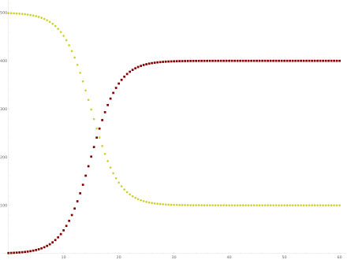
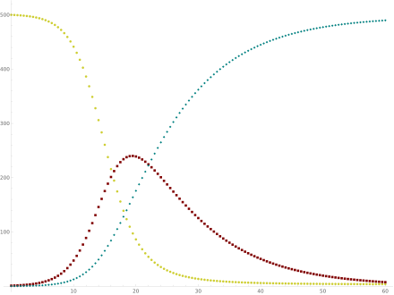
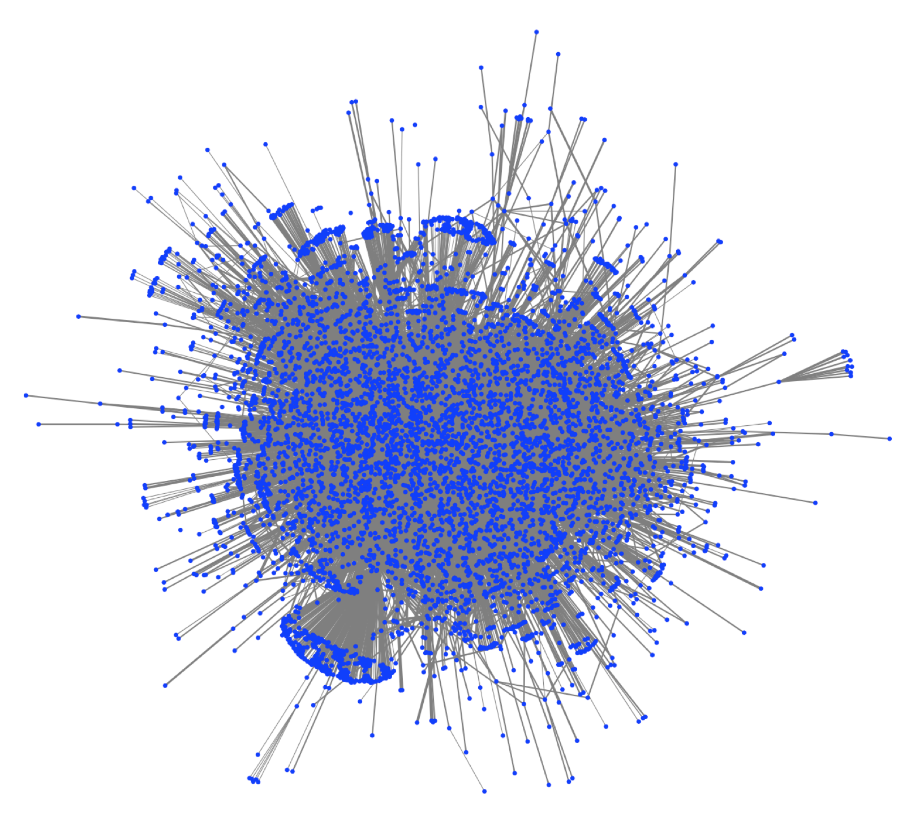
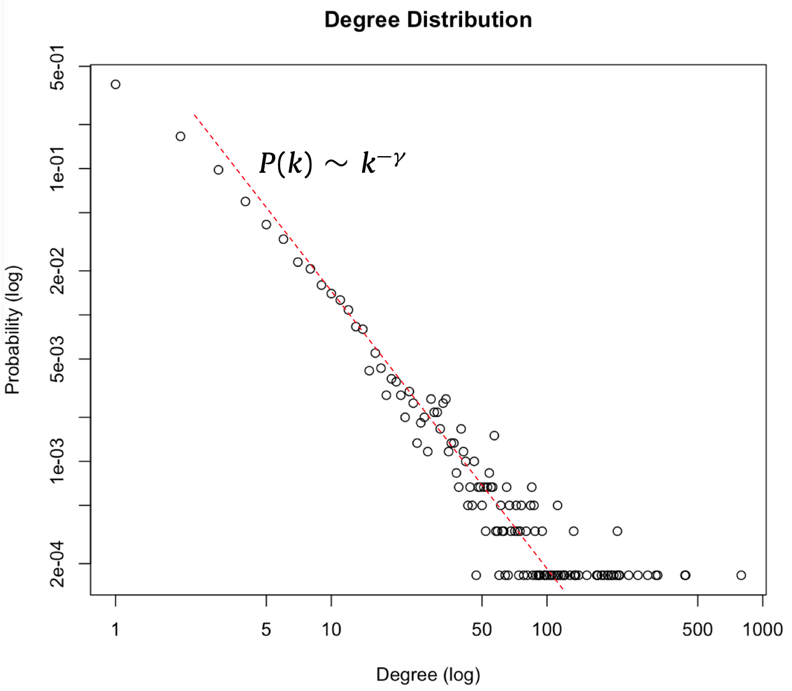
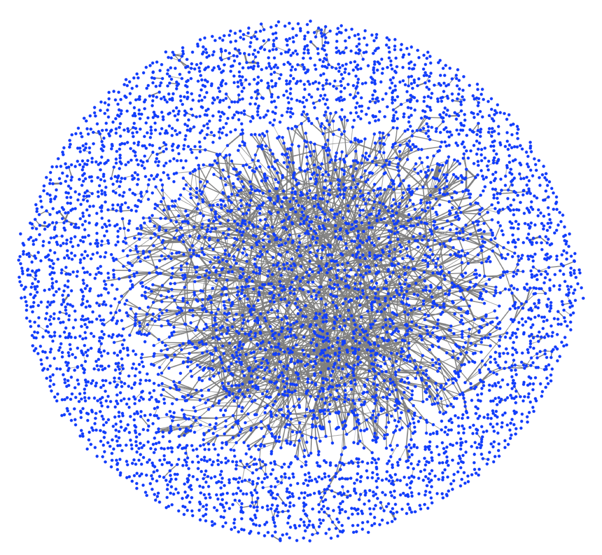

---
output:
  html_document: default
  pdf_document: default
---
# Các mô hình lan truyền và phòng ngừa dịch bệnh
## Các mô hình lan truyền
### Mô hình lan truyền cổ điển:
Mô hình lan truyền được Kermack và McKendrick [1] phát triển đầu tiên vào năm 1927, dựa trên lý thuyết trường trung bình động (dynamic mean-field theory). Giả thuyết cơ bản của mô hình này là mỗi cá nhân tương tác với tất cả các cá nhân khác trong xã hội một cách ngẫu nhiên giống nhau. Xác suất nhiễm bệnh, khỏi bệnh,... của mỗi cá nhân là giống nhau và tỷ lệ với tỷ lệ trung bình chung của xã hội. Chi tiết của mô hình này có thể tìm đọc trên [Wikipedia](https://en.wikipedia.org/wiki/Mathematical_modelling_of_infectious_disease) hoặc trong [bài viết](http://vinif.org/vi/khoa-hoc-thuong-thuc/read/1/mo-hinh-du-bao-ngan-han-va-dai-han-kha-nang-lan-rong-cua-dich-2019-ncov-tu-vu-han-o-pham-vi-trung-quoc-va-quoc-te) của TS. Hoàng Ngọc Thạch và TS. Phan Thị Hà Dương (VinIF) với các tham số cập nhật cho dịch bệnh Covid-19. Ở đây tôi tóm lược một số kết quả chính của mô hình cổ điển như sau:

Một tập hợp N (cố định) cá nhân/người dân có thể ở trong một số trạng thái xác định là:
+ Có khả năng mắc bệnh (**S**usceptible)
+ Nhiễm bệnh và có thể lây cho người khác (**I**nfected)
+ Không còn khả năng mắc bệnh (**R**emoved hay Recovered - đã chữa khỏi hoặc đã chết).

Có thể mô phỏng quá trình chuyển đổi trạng thái theo nhiều cách, trong đó 2 mô hình phổ biến nhất là:
* SIS: 

+ Một cá nhân từ **S** có thể bị nhiễm bệnh và chuyển sang **I** với xác suất $\alpha$ trong một đơn vị thời gian tỷ lệ với tỷ lệ nhiễm bệnh hiện tại: $\alpha = \beta\frac{I}{N}$,  

trong đó $I$ là số người bị nhiễm hiện tại và $\beta$ gọi là tỷ lệ nhiễm bệnh (infection rate). Phương trình này áp dụng như nhau cho mỗi cá nhân và dựa trên giả thuyết mỗi cá nhân tiếp xúc với tất cả mọi người trong xã hội với xác suất như nhau.

+ Một cá nhân từ **I** có thể được chữa khỏi và chuyển sang **S** với xác suất $\mu$ trong một đơn vị thời gian, với giả thuyết việc chữa bệnh được áp dụng như nhau cho mọi người bệnh.

Kết hợp lại chúng ta có thể mô tả quá trình động lực của số nhiễm bệnh (**I**) và khỏe mạnh (**S**) bằng các phương trình vi phân xác định như sau :

\begin{equation} 
  \frac{dI}{dt} = S\times\beta \frac{I}{N}-\mu I
  (\#eq:SIS1)
\end{equation}

\begin{equation} 
  \frac{dS}{dt} = -I\times\beta \frac{S}{N}+\mu I
  (\#eq:SIS2)
\end{equation}

Phương trình \@ref(eq:SIS1) và \@ref(eq:SIS2) có thể hiểu là xác suất một người khỏe bị nhiễm bệnh $I/S$ bằng $\beta$ nhân tỷ lệ nhiễm trung bình trong cộng đồng. Xác suất một người nhiễm khỏi bệnh $S/I$ bằng $\mu$

(mặc dù các quá trình $S -> I -> S$ là ngẫu nhiên nhưng cách tiếp cận trên cho phép rút gọn lại thành phương trình xác định)

Một thông số quan trọng là một người bệnh làm lây nhiễm thêm cho bao nhiêu người trong một đơn vị thời gian có thể biểu diễn là:
\begin{equation*} 
  R = \frac{dI^*}{Idt} = \beta \frac{S}{N}
  (\#eq:SIS2)
\end{equation*}
trong đó $I^*$ là số lây nhiễm mới.

Trong giai đoạn đầu của dịch bệnh khi $S\approx N$ thì các phương trình có thể được rút gọn xấp xỉ và ta có thể định nghĩa $R_0 = \frac{\beta}{\mu}$ gọi là Hệ số lây nhiễm cơ bản. Đây là số ca nhiễm F1 gây ra bởi một ca nhiễm F0 trong cộng đồng trong một đơn vị thời gian. Kết quả chính của hệ phương trình là:

+ Nếu $R_0 > 1$ thì dịch bệnh sẽ bùng phát
+ Nếu $R_0 < 1$ thì dịch bệnh sẽ tự tiêu biến
+ Nếu $R_0 = 1$ thì dịch bệnh ở trạng thái dừng đặc hữu (endemic). Với số bệnh là hằng số mà không cần tác động

Ở Việt Nam hiện nay một số bệnh nhân F0 có thể tiếp xúc lên đến **hơn 200 lần**. Giả sử trung bình các bệnh nhân F0 tiếp xúc 30 người trước khi bị phát hiện và nếu tỷ lệ nhiễm bệnh chỉ là 10% thì $\beta = 30* 10\% = 3$. Với giá trị $\mu < 1$ thì $R_0 > 3$ và nguy cơ gây ra bùng phát là rất cao.

Kết quả giải hệ phương trình trên cho toàn bộ quá trình động lực như sau:
```{r SIS, fig.align = 'center', out.width = "50%", fig.cap = "Kết quả giải hệ SIS - nguồn: Wikipedia", echo = FALSE}

```


* SIR: một cá nhân từ **S** có thể bị nhiễm bệnh và chuyển sang **I** và một cá nhân từ **I** có thể được chữa khỏi (và không thể lây nhiễm tiếp) hoặc chết đi và chuyển sang **R**. Cơ chế tương tự như SIS trong đó phân biệt rõ hơn trạng thái **R**. (Trong SIS thì **R** ẩn trong **S**). Dưới đây là kết quả giải hệ SIR từ nguồn [Wikipedia](https://en.wikipedia.org/wiki/Compartmental_models_in_epidemiology)

```{r SIR, fig.align = 'center', out.width = "50%", fig.cap = "Kết quả giải hệ SIR - nguồn: Wikipedia", echo = FALSE}

```

Nhìn chung, kết quả từ các mô hình cổ điển SIS và SIR cho thấy trong giai đoạn đầu, tỷ lệ nhiễm (cho SIS) và chết (cho SIR) sẽ tăng theo hàm mũ và đạt ngưỡng bão hòa sau một thời gian. Ngưỡng này thường sẽ rất cao lên đến nhiều chục % trong dân số. Ở đó số lượng người khỏe còn quá ít nên số lượng nhiễm mới bằng số lượng khỏi ($\beta\ S = \mu I$) hay còn gọi là **miễn dịch cộng đồng**.

### Mô hình lan truyền theo mạng lưới:
Các giả thuyết rằng mỗi cá nhân giống nhau và giao tiếp ngẫu nhiên đều trong toàn xã hội của các mô hình cổ điển là khá đơn giản. Trên thực tế, mỗi người có mạng lưới tương tác xã hội của riêng mình. Phần lớn các cá nhận chỉ tương tác với một số lượng hạn chế người khác, trong khi đó có một phần nhỏ cá nhân tương tác với rất nhiều người khác. Dựa trên mô hình mạng lưới, Diekmann [2] cho rằng Hệ số lây nhiễm cơ bản $R_0$ cần phải điều chính tính đến cấu trúc của mạng lưới tương tác. 

```{r network1, fig.align = 'center', out.width = "80%", fig.cap = "Hình ảnh mô tả một mạng lưới tương tác xã hội - nguồn: tác giả", echo = FALSE}

```

Mạng lưới tương tác xã hội cũng giống như nhiều mạng lưới phức hợp khác ("complex networks") với nhiều đặc trưng riêng biệt, trong đó các quan trọng nhất về cấu trúc là:

+ Tính phân bố bậc: Bậc k - hay số tương tác của mỗi cá nhân - thường phân bố theo dạng hàm mũ, phản ánh tính khác biệt về sự tương tác rất lớn: một số cá nhân nhỏ tương tác với rất nhiều cá nhân khác trong khi phần lớn các cá nhân chỉ tương tác với một số nhỏ cá nhân khác.

```{r network1dist, fig.align = 'center', out.width = "50%", fig.cap = "Phân phối bậc của các cá nhân trong mạng lưới trên - nguồn: tác giả", echo = FALSE}

```

+ Tính phân nhóm: Mạng tương tác xã hội thường phân cụm thành những nhóm riêng biệt. Phần lớn các cá nhân chỉ tương tác với những cá nhân trong cùng một nhóm, một phần nhỏ các cá nhân tương tác với những cá nhân trong nhiều nhóm khác nhau. Các các nhân này mang tính liên kết rất cao và có thể, nhưng không nhất thiết, là các cá nhân có bậc cao hoặc rất cao.

```{r network2, fig.align = 'center', out.width = "60%", fig.cap = "Một mạng lưới xã hội với tính phân nhóm cao - nguồn: [3]", echo = FALSE}
knitr::include_graphics("images/public-figure.png")
```

Một trong những phát triển đầu tiên của mô hình này do Pastor-Satorras and Vespignani (2001) đề xuất [4], kế thừa trên lý thuyết trường trung bình động nhưng xét sự khác nhau của các cá nhân theo số bậc tương tác k, gọi là "degree-based mean-field theory" (DBMF). Theo đó, các cá nhân được mô tả khác nhau theo số tương tác k mà họ có, và phương trình \@ref(eq:SIS1) được viết lại như sau cho mỗi giá trị bậc k:

\begin{equation} 
  \frac{dI_k}{dt} = \beta k [1-I_k]\sum_{k'} P[k'|k]\times \frac{I_{k'}}{N} -\mu I_k
  (\#eq:DBMF1)
\end{equation}

Dựa theo biểu thức đầu tiên của vế phải phương trình trên ta thấy một cá nhân khỏe có bậc k có thể bị nhiễm với xác suất là tích của:

- k: số tương tác anh ta có

- Tổng của $P[k'|k]$: Xác suất anh ta có liên kết với một cá nhân có bậc k' khác và $\frac{I_{k'}}{N}$: Tỷ lệ cá nhân có bậc k' bị nhiễm

Dựa trên cấu trúc của mạng lưới chúng ta có thể ước lượng $P[k'|k]$ và giải hệ trên một cách xấp xỉ bởi phương pháp phân tích trung bình tuyến tính [6] (lời giải chính xác không khả thi). Kết quả chính của mô hình này là điều kiện xảy ra bùng phát dịch (điểm tới hạn) nếu:

$R_0 = \frac{\beta}{\mu} > \frac{<k>}{<k^2>}$

($<>$ là ký hiệu của kỳ vọng, giả thiết các nút không tương quan (uncorrelated network)).

Trong hình vẽ 4.3 tôi lấy ví dụ một mạng xã hội nhỏ gồm 6005 nút. Các dữ liệu về tương tác xã hội thực không hoàn toàn giống mạng xã hội và không sẵn có, do vậy kết quả có thể khác nhiều. Với mạng lưới trên ta có thể tính các thông số mạng là: 

- $<k> = 7.15$

- $<k^2> = 79$

- $\frac{<k>}{<k^2>} = 0.012$ 

Giả sử tỷ lệ chữa khỏi $\mu = 0.4$ thì xác suất nhiễm bệnh khi tiếp xúc $\beta$ cần phải dưới giá trị $\mu\frac{<k>}{<k^2>} = 0.4*0.012 \approx 0.5\%$ và rất không khả thi.

Trong trường hợp cách ly các tương tác (nói rõ hơn trong phần sau) chúng ta sẽ có được mạng lưới mới với số cạnh tối thiểu:

```{r network3, fig.align = 'center', out.width = "80%", fig.cap = "Một mạng lưới xã hội với tính phân nhóm cao - nguồn: [3]", echo = FALSE}

```
Khi đó các thông số mạng trở thành:

- $<k> = 1.27$

- $<k^2> = 3.45$

- $\frac{<k>}{<k^2>} = 0.289$ 

Giả sử tỷ lệ chữa khỏi $\mu = 0.4$ thì xác suất nhiễm bệnh khi tiếp xúc $\beta$ cần phải dưới giá trị $\mu\frac{<k>}{<k^2>} = 0.4*0.289 \approx 11.5\%$. Xác suất này dễ đạt được hơn và cao hơn ngưỡng trước khi cách ly hơn 20 lần.

### Các phương pháp mô phỏng:
Việc xây dựng các mô hình gần với thực tế hơn thường sẽ khiến cho các phương trình trở nên phức tạp và rất khó giải. Khi đó các phương pháp mô phỏng sẽ trở nên đặc biệt hữu ích. Ví dụ với một dữ liệu mạng lưới cho trước chúng ta có thể ước lượng xác suất bùng phát dịch bằng cách cho lan truyền giả định lặp lại nhiều lần, với rất nhiều tham số khác nhau. (to be continued)

## Các mô hình phòng ngừa
Các mô hình trong phần trên giả định việc lan truyền tự nhiên và không có tác động từ bên ngoài. Trong thực tế, chúng ta luôn mong muốn ngăn chặn số người bị nhiễm bệnh và tác động vào việc lan truyền. Các mô hình phòng ngừa được đặt ra nhằm tối ưu hiệu quả của tác động hoặc giảm thiểu chi phí cho một mục tiêu xác định. (to be continued)

### Mô hình tiêm ngừa (immunization model)
Trong trường hợp đã có vaccin phòng bệnh thì tiêm chủng mở rộng là biện pháp an toàn nhất (nếu có thể). Đây chính là các chương trình tiêm chủng cho mọi trẻ em đã được áp dụng. Ở một số nơi khác như các nước châu Phi, số lượng vaccin có ít nên các mô hình immunization có thể được sử dụng để xác định ra đối tượng vaccin có hiệu quả nhất trong việc ngăn ngừa lan truyền trong cộng đồng. (to be continued)

### Mô hình cách ly xã hội
Trong trường hợp chưa có vaccin phòng bệnh thì biện pháp chính là dùng các dụng cụ bảo hộ tối đa (tiếp xúc nhưng giảm thiểu xác suất lây nhiễm), tương ứng việc giảm hệ số $\beta$ ban đầu, hoặc trong trường hợp bất khả kháng (không xác định được ai đang nhiễm và sẽ nhiễm cho ai) thì phá vỡ mạng lưới tương tác xã hội (cách ly) là biện pháp cuối cùng. Cách phá vỡ mạng lưới có thể bao gồm:
+ Phá vỡ nút (cá nhân) bằng cách ly tập trung
+ Phá vỡ cạnh (phá vỡ tương tác) bằng cách ly xã hội

## Tham khảo:
[1] W. O. Kermack and A. G. McKendrick, Contributions to the mathematical theory of epidemics part I, Proc. R. Soc. Edinb., A115, 700–721, 1927.

[2] Diekmann, O., H. Heesterbeek, and T. Britton (2012), Math-
ematical Tools for Understanding Infectious Disease Dy-
namics (Princeton University Press, Princeton, USA).

[3] Quang Nguyen, Hanh-Duyen Dinh , Thi-Trang Le , Thanh-Trung Nguyen , Michele Bellingeri, "Structure and Robustness of Facebook's pages networks"
(Applied Network Science - accepted)

[4] Pastor-Satorras, R., and A. Vespignani (2001b), Phys. Rev. Lett. 86, 3200.

[5] Romualdo Pastor-Satorras, Claudio Castellano, Piet Van Mieghem, Alessandro Vespignani, "Epidemic processes in complex networks". Review of Modern Physics 87(3) 2014

[6] Bogun ̃a ́, M., and R. Pastor-Satorras (2002), Phys. Rev. E 66, 047104.